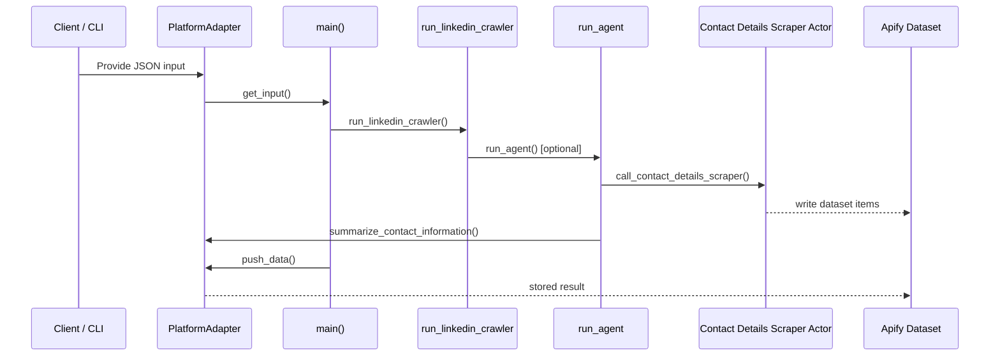

# Request flow

This document explains how a request travels through the project from the moment a client provides input until the data is stored in the Apify dataset (the database used by this Actor).

## Steps

1. **Client input** – The Actor is started via the Apify platform or the local CLI and receives a JSON input. Entry points are `src/__main__.py` for the platform and `src/cli.py` for local runs.
2. **Adapter layer** – Depending on the environment, either `ApifyAdapter` or `LocalAdapter` implements the `PlatformAdapter` interface. The adapter fetches the input and is responsible for pushing data back.
3. **Main workflow** – `main` in [`src/main.py`](../src/main.py) uses the dependency injection container to get a processor instance.
4. **Input validation** – `InputValidationService` validates and parses the raw input into a structured `ActorInput` schema.
5. **Query analysis** – `QueryAnalysisService` analyzes the query to determine if it requires agent processing or simple crawling.
6. **Processing decision** – Based on the analysis, the processor routes the request to either:
   - **Agent mode** – Uses `LinkedInAgent` with LlamaIndex tools for complex queries requiring reasoning
   - **Crawler mode** – Uses `LinkedInCrawler` directly for simple URL extraction
7. **Tool execution** – If using agent mode, tools like `call_contact_details_scraper` and `summarize_contact_information` are available.
8. **Contact Details Scraper** – The scraper service calls the Apify Actor and retrieves dataset results using `ApifyClientAsync`.
9. **Dataset storage** – The adapter's `push_data` method writes the final data back to the Apify dataset.

## Architecture Components

### Core Services

- **DIContainer** – Manages all service dependencies with lazy loading
- **InputValidationService** – Validates input schemas and handles errors
- **QueryAnalysisService** – Determines processing strategy based on query content
- **ContactDetailsScraperService** – Handles Apify Actor integration
- **SummarizationService** – Provides LLM-based summarization

### Processing Flow

- **LinkedInProcessor** – Central orchestrator that coordinates the entire workflow
- **LinkedInAgent** – LlamaIndex-based agent for complex reasoning tasks  
- **LinkedInCrawler** – Direct crawler for simple URL extraction

## Configuration Management

All configuration is centralized in `src/config/settings.py`:

- Apify settings (tokens, actor IDs, default parameters)
- LLM settings (models, temperature, tokens)
- Agent behavior (action words, processing rules)

## Sequence diagram

