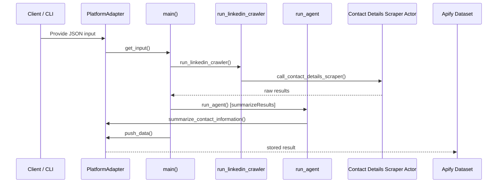

# Request flow

This document explains how a request travels through the project from the moment a client provides input until the data
is stored in the Apify dataset (the database used by this Actor).

## Steps

1. **Client input** – The Actor is started via the Apify platform or the local CLI and receives a JSON input. Entry
   points are `src/__main__.py` for the platform and `src/cli.py` for local runs.
2. **Adapter layer** – Depending on the environment, either `ApifyAdapter` or `LocalAdapter` implements the
   `PlatformAdapter` interface. The adapter fetches the input and is responsible for pushing data back.
3. **Main workflow** – `main` in [`src/main.py`](../src/main.py) validates the input and calls `run_linkedin_crawler`.
4. **Crawler** – `run_linkedin_crawler` in [`src/crawler/linkedin.py`](../src/crawler/linkedin.py) handles the crawling.
5. **Summarization** – When `summarizeResults` is enabled, `main` invokes `run_agent` with the collected contacts to
   produce a short summary.
6. **Agent tools** – `run_agent` registers tools such as `call_contact_details_scraper` and
   `summarize_contact_information` from [`src/tools.py`](../src/tools.py).
7. **Contact Details Scraper** – `call_contact_details_scraper` runs another Apify Actor and retrieves its dataset
   results using `ApifyClientAsync.dataset().list_items()`.
8. **Dataset storage** – The adapter's `push_data` method writes the final data back to the Apify dataset.

## Sequence diagram

